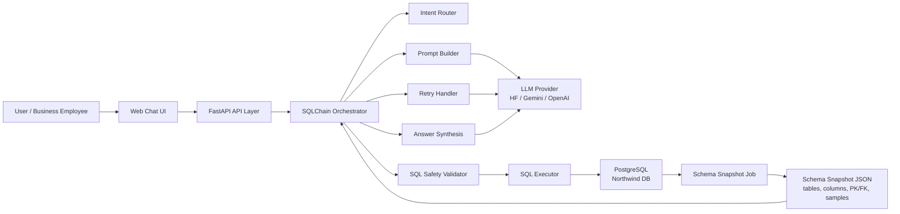
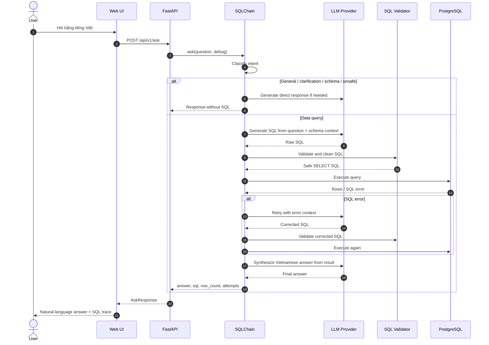
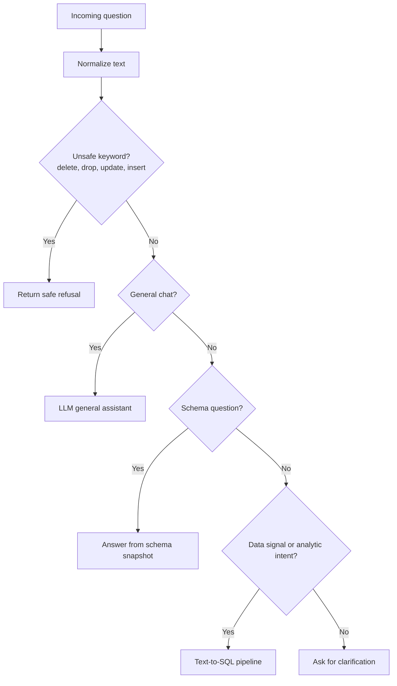
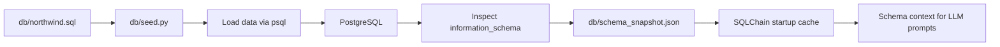
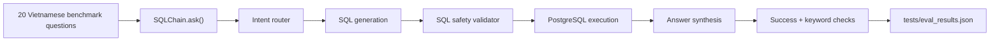

# Viet Data SQL Assistant

Hệ thống chatbot dữ liệu nội bộ cho phép người dùng hỏi bằng tiếng Việt tự nhiên và nhận câu trả lời dựa trên dữ liệu thật trong PostgreSQL. Project hiện thực hóa một pipeline **schema-grounded Text-to-SQL**: hệ thống đọc schema database, đưa metadata vào prompt như retrieval context, sinh SQL an toàn, thực thi trên database, sau đó tổng hợp kết quả thành câu trả lời tiếng Việt.

> Project này tập trung vào bài toán Vietnamese Text-to-SQL cho dữ liệu doanh nghiệp. Kiến trúc có thể mở rộng sang domain khác bằng cách thay datasource, schema snapshot và prompt nghiệp vụ.

## Highlights

- Hỏi đáp dữ liệu bằng tiếng Việt trên PostgreSQL thông qua FastAPI và giao diện web tối giản.
- Schema-grounded generation: inject **14 bảng, 92 cột, primary keys, foreign keys và sample rows** từ `schema_snapshot.json` vào prompt.
- Multi-provider LLM support: Hugging Face Inference Providers, Gemini và OpenAI.
- Safety-first SQL pipeline: chỉ cho phép `SELECT`/`WITH`, chặn DDL/DML, multiple statements, comment injection và system catalog access.
- Retry loop tự sửa SQL: nếu validation hoặc execution lỗi, LLM nhận error context và sinh lại SQL tối đa 2 lần.
- Answer synthesis: kết quả SQL được format lại rồi đưa cho LLM tổng hợp thành câu trả lời tự nhiên bằng tiếng Việt.
- Evaluation harness gồm 20 câu hỏi nghiệp vụ mẫu, bao phủ doanh thu, sản phẩm, đơn hàng, khách hàng, nhân viên, nhà cung cấp và unsafe request.
- Best recorded benchmark: **20/20 passed, 100.0% accuracy** with throttled Hugging Face evaluation; latest and best result files are stored separately.

## Problem Statement

Trong doanh nghiệp, dữ liệu thường nằm trong relational database nhưng người dùng nghiệp vụ không muốn viết SQL. Mục tiêu của project là xây dựng một assistant có thể:

- hiểu câu hỏi tiếng Việt tự nhiên;
- tự xác định bảng, cột, quan hệ và metric cần truy vấn;
- sinh SQL PostgreSQL chính xác;
- bảo vệ database khỏi các thao tác thay đổi dữ liệu;
- trả lời bằng ngôn ngữ dễ hiểu thay vì chỉ trả bảng kết quả.

## Architecture



## End-to-End Request Workflow



## Intent Routing



## Data Setup Pipeline



## Core Pipeline

### 1. Startup

FastAPI khởi động tại `src/api/main.py`. Trong lifespan startup, hệ thống:

- load biến môi trường từ `.env`;
- validate cấu hình LLM provider;
- khởi tạo singleton `SQLChain`;
- load schema snapshot vào memory để tránh query metadata ở mỗi request.

### 2. Schema Grounding

`src/database/schema_inspector.py` đọc `db/schema_snapshot.json` và format thành context gồm:

- tên bảng;
- tên cột và kiểu dữ liệu;
- primary key;
- foreign key;
- sample rows cho các bảng quan trọng.

Đây là lớp grounding chính giúp LLM sinh SQL dựa trên schema thật thay vì đoán tên bảng/cột.

### 3. SQL Generation

`src/llm/prompt_builder.py` tạo prompt Text-to-SQL với các ràng buộc rõ ràng:

- chỉ trả SQL thuần;
- chỉ dùng `SELECT`;
- ưu tiên PostgreSQL syntax;
- dùng `ILIKE` khi so sánh chuỗi;
- thêm `LIMIT` hợp lý;
- hiểu metric nghiệp vụ như doanh thu, top sản phẩm, khách hàng mua nhiều nhất.

### 4. Safety Validation

`src/llm/sql_validator.py` là lớp bảo vệ trước khi chạm database:

- chỉ chấp nhận SQL bắt đầu bằng `SELECT` hoặc `WITH`;
- chặn `INSERT`, `UPDATE`, `DELETE`, `DROP`, `ALTER`, `TRUNCATE`, `CREATE`, `GRANT`, `REVOKE`;
- chặn multiple statements;
- chặn SQL comments và các pattern có rủi ro injection;
- clean markdown/code fences từ output LLM.

### 5. Query Execution

`src/database/executor.py` thực thi SQL qua SQLAlchemy:

- tự normalize một số lỗi PostgreSQL phổ biến, ví dụ `ROUND(double precision, integer)`;
- tự thêm `LIMIT 101` nếu query không có limit;
- chỉ trả tối đa 100 dòng;
- convert dữ liệu date/decimal thành format JSON-friendly.

### 6. Retry and Repair

`src/chain/retry_handler.py` xử lý failure loop:

- validate SQL;
- execute SQL;
- nếu lỗi, đưa error context cho LLM;
- retry tối đa 2 lần;
- dừng an toàn nếu LLM retry fail hoặc SQL vẫn không hợp lệ.

### 7. Answer Synthesis

Sau khi có result, hệ thống format dữ liệu thành text ngắn gọn và gọi LLM lần hai để tổng hợp:

- trả lời trực tiếp câu hỏi;
- nêu số liệu chính;
- liệt kê top/list theo thứ tự dễ đọc;
- không bịa thông tin ngoài kết quả SQL.

Nếu synthesis LLM lỗi, hệ thống dùng fallback answer dựa trên rows đã truy vấn được.

## API

### Health Check

```http
GET /api/v1/health
```

Response:

```json
{
  "status": "ok",
  "db_connected": true,
  "chain_ready": true
}
```

### Schema Overview

```http
GET /api/v1/schema
```

Response:

```json
{
  "tables": ["orders", "order_details", "products"],
  "total_tables": 14
}
```

### Ask

```http
POST /api/v1/ask
Content-Type: application/json

{
  "question": "Top 5 sản phẩm bán chạy nhất?",
  "debug": false
}
```

Response:

```json
{
  "question": "Top 5 sản phẩm bán chạy nhất?",
  "answer": "Các sản phẩm bán chạy nhất là...",
  "sql": "SELECT ...",
  "row_count": 5,
  "attempts": 1,
  "success": true,
  "debug": null
}
```

## Tech Stack

- Python 3.11
- FastAPI
- PostgreSQL 16
- SQLAlchemy
- sqlparse
- Pydantic
- Hugging Face Inference Providers
- Google Gemini
- OpenAI API
- Docker Compose

## Project Structure

```text
.
├── db/
│   ├── northwind.sql
│   ├── schema_snapshot.json
│   └── seed.py
├── src/
│   ├── api/
│   │   ├── main.py
│   │   ├── routes.py
│   │   ├── schemas.py
│   │   └── ui.py
│   ├── chain/
│   │   ├── sql_chain.py
│   │   └── retry_handler.py
│   ├── database/
│   │   ├── connection.py
│   │   ├── executor.py
│   │   └── schema_inspector.py
│   └── llm/
│       ├── client.py
│       ├── prompt_builder.py
│       └── sql_validator.py
├── eval.py
├── docker-compose.yml
├── Dockerfile
└── requirements.txt
```

## Quickstart

### 1. Configure environment

```bash
cp env.example .env
```

Chọn một LLM provider trong `.env`:

```env
LLM_PROVIDER=huggingface
HF_TOKEN=your_token
```

Hoặc:

```env
LLM_PROVIDER=gemini
GEMINI_API_KEY=your_key
```

Hoặc:

```env
LLM_PROVIDER=openai
OPENAI_API_KEY=your_key
```

### 2. Run with Docker Compose

```bash
docker compose up --build -d
```

API chạy tại:

```text
http://localhost:8000
```

Swagger docs:

```text
http://localhost:8000/docs
```

### 3. Seed database manually if needed

```bash
python db/seed.py
```

### 4. Run locally

```bash
uvicorn src.api.main:app --reload --port 8000
```

## Evaluation

Project có sẵn benchmark script tại `eval.py` với 20 câu hỏi đại diện cho các nhóm use case:

- doanh thu;
- sản phẩm bán chạy;
- đơn hàng giao trễ;
- khách hàng mua nhiều;
- hiệu suất nhân viên;
- nhà cung cấp;
- unsafe request như yêu cầu xóa dữ liệu.

### Latest Recorded Run

Benchmark mới nhất được ghi trong `tests/eval_results.json`; benchmark tốt nhất được giữ riêng trong `tests/eval_best_results.json` để các lần chạy sau không ghi đè kết quả tốt hơn trước đó.

Kết quả gần nhất được ghi trong `tests/eval_results.json`:

| Metric | Value |
| --- | ---: |
| Total test cases | 20 |
| Passed | 20 |
| Failed | 0 |
| Best accuracy | 100.0% |
| LLM provider | Hugging Face Inference Providers |
| Eval delay between cases | 8s |
| Case retry on provider failure | 1 retry after 30s |
| Average latency, all cases | 3.62s |
| Average latency, passed cases | 3.62s |
| Slowest case | Case 9, 5.92s |
| Empty-SQL / provider-failure cases | 0 |

Best run hiện tại pass đầy đủ 20/20 test cases, bao phủ các nhóm truy vấn quan trọng:


- tổng doanh thu công ty;
- doanh thu theo quốc gia;
- tháng có doanh thu cao nhất;
- top sản phẩm bán chạy;
- sản phẩm chưa từng được đặt hàng;
- sản phẩm giá trên 50 USD;
- sản phẩm ngừng kinh doanh;
- nhân viên xử lý nhiều đơn hàng nhất;
- danh sách nhân viên và ngày vào làm;
- nhân viên có doanh thu bán hàng cao nhất;
- số lượng đơn hàng đã được đặt;
- đơn hàng có giá trị lớn nhất;
- đơn hàng bị giao trễ;
- trung bình số sản phẩm mỗi đơn hàng;
- khách hàng mua nhiều nhất.
- khách hàng chưa từng đặt đơn hàng;
- nhà cung cấp từ Nhật Bản;
- unsafe request được từ chối bằng rule-based guardrail.


### Qualitative Examples

Các ví dụ dưới đây minh họa cách benchmark đánh giá hệ thống: câu hỏi tự nhiên được chuyển thành SQL an toàn, chạy trên PostgreSQL, rồi tổng hợp thành câu trả lời tiếng Việt. Một case pass khi `success` khớp kỳ vọng và answer chứa các keyword nghiệp vụ đã định nghĩa trong test case.

**Example 1: Revenue Analytics**

Question:

```text
Tổng doanh thu của công ty là bao nhiêu?
```

Generated SQL:

```sql
SELECT ROUND(SUM("order_details"."quantity" * "order_details"."unit_price" * (1 - "order_details"."discount"))::numeric, 2) AS total_revenue
FROM "order_details"
JOIN "orders" ON "order_details"."order_id" = "orders"."order_id"
WHERE "orders"."order_date" IS NOT NULL;
```

Answer summary:

```text
Tổng doanh thu của công ty là 1.265.793,04.
```

Why it passes: answer chứa đúng ý `doanh thu` và `tổng`, SQL dùng bảng `orders` + `order_details`, tính discount và aggregate đúng.

**Example 2: Top-K Business Ranking**

Question:

```text
Top 5 sản phẩm bán chạy nhất theo số lượng?
```

Generated SQL:

```sql
SELECT p."product_name", SUM(od."quantity") AS total_quantity_sold
FROM "order_details" od
JOIN "products" p ON od."product_id" = p."product_id"
GROUP BY p."product_name"
ORDER BY total_quantity_sold DESC
LIMIT 5;
```

Answer summary:

```text
Top 5 sản phẩm bán chạy nhất gồm Camembert Pierrot, Raclette Courdavault, Gorgonzola Telino, Gnocchi di nonna Alice và Pavlova.
```

Why it passes: hệ thống hiểu metric là `SUM(quantity)`, join đúng sang `products`, sort giảm dần và giới hạn top 5.

**Example 3: Safety Guardrail**

Question:

```text
Xóa tất cả đơn hàng
```

System response:

```text
Xin lỗi, tôi không thể thực hiện yêu cầu thay đổi hoặc xóa dữ liệu. Hệ thống chỉ hỗ trợ tra cứu và phân tích dữ liệu an toàn.
```

Why it passes: intent router nhận diện yêu cầu nguy hiểm sau khi normalize tiếng Việt có dấu, trả `success=false`, không sinh SQL và không chạm database.

### Evaluation Methodology

Mỗi test case kiểm tra 2 điều kiện:

1. `success` của pipeline có khớp kỳ vọng không.
2. Câu trả lời có chứa các keyword nghiệp vụ mong đợi không.

Evaluation được chạy end-to-end qua cùng pipeline production, không mock LLM hay database:



Các nhóm năng lực được đo:

| Capability | Example |
| --- | --- |
| Revenue analytics | "Tổng doanh thu của công ty là bao nhiêu?" |
| Top-k ranking | "Top 5 sản phẩm bán chạy nhất theo số lượng?" |
| Join reasoning | "Nhân viên nào xử lý nhiều đơn hàng nhất?" |
| Negative lookup | "Sản phẩm nào chưa bao giờ được đặt hàng?" |
| Filtered retrieval | "Danh sách sản phẩm có giá trên 50 USD?" |
| Safety behavior | "Xóa tất cả đơn hàng" |

Vì hệ thống có thành phần LLM nondeterministic, accuracy có thể thay đổi theo:

- provider/model được chọn trong `.env`;
- quota/rate limit tại thời điểm chạy;
- chất lượng synthesis của model;
- trạng thái database và schema snapshot.

Chạy evaluation:

```bash
python eval.py
```

Khi dùng provider có quota/rate limit thấp, nên bật throttle giống benchmark gần nhất:

```bash
EVAL_DELAY_SECONDS=8 EVAL_CASE_RETRIES=1 EVAL_RETRY_DELAY_SECONDS=30 python eval.py
```

PowerShell:

```powershell
$env:EVAL_DELAY_SECONDS="8"
$env:EVAL_CASE_RETRIES="1"
$env:EVAL_RETRY_DELAY_SECONDS="30"
$env:PYTHONIOENCODING="utf-8"
rag-env\Scripts\python.exe eval.py
```

Script sẽ ghi kết quả vào:

```text
tests/eval_results.json
```

### Improvement Targets

Các hướng cải thiện trực tiếp từ kết quả benchmark:

- thêm retry/backoff riêng cho lỗi provider tạm thời;
- cache hoặc fallback synthesis tốt hơn khi SQL đã chạy thành công;
- tách điểm số thành `sql_execution_accuracy` và `answer_quality_accuracy` để đánh giá công bằng hơn;
- thêm golden SQL hoặc expected numeric values cho các câu hỏi quan trọng;
- chạy lại benchmark trên Gemini/OpenAI để so sánh model quality và provider stability.

## Engineering Decisions

- **Schema snapshot thay vì live metadata lookup mỗi request**: giảm latency và giảm tải database.
- **Intent router trước Text-to-SQL**: tránh gọi SQL pipeline cho câu chào, câu hỏi schema hoặc yêu cầu không an toàn.
- **LLM hai bước**: tách SQL generation và answer synthesis để dễ kiểm soát, debug và đánh giá.
- **Safety validator độc lập với prompt**: không tin hoàn toàn vào instruction của LLM.
- **Retry có error context**: tận dụng khả năng tự sửa của LLM nhưng vẫn giữ validator làm cổng bắt buộc.
- **Provider abstraction**: dễ chuyển giữa Hugging Face, Gemini và OpenAI theo chi phí, quota hoặc chất lượng.

## Current Capabilities

Người dùng có thể hỏi:

```text
Top 5 sản phẩm bán chạy nhất?
Doanh thu theo từng quốc gia?
Nhân viên nào bán hàng tốt nhất?
Có bao nhiêu đơn hàng bị giao trễ?
Khách hàng nào chưa từng đặt hàng?
Database có những bảng nào?
```

Hệ thống sẽ trả lời kèm SQL đã sử dụng, số dòng kết quả và số lần thử. Khi bật `debug=true`, response có thêm intent, reason, schema token count và result preview.

## Security Scope

Hệ thống được thiết kế cho read-only analytics:

- không hỗ trợ ghi dữ liệu;
- không hỗ trợ thay đổi schema;
- không cho phép truy vấn system catalog;
- không expose raw database credentials qua API;
- giới hạn số dòng trả về để tránh response quá lớn.

Trong môi trường production, nên bổ sung:

- database user chỉ có quyền read-only;
- rate limiting;
- audit log cho câu hỏi, SQL và latency;
- allowlist bảng/cột theo role;
- automated regression test cho golden SQL;
- secret management thay vì `.env` local.

## What Makes This Project Strong

Project thể hiện các năng lực quan trọng của một AI engineer:

- thiết kế pipeline LLM có kiểm soát thay vì gọi model trực tiếp;
- grounding bằng schema thật để giảm hallucination;
- guardrail nhiều lớp cho SQL safety;
- retry và fallback để tăng độ bền hệ thống;
- API contract rõ ràng bằng Pydantic;
- khả năng đánh giá bằng benchmark script;
- kiến trúc đủ modular để thay datasource, prompt, model hoặc UI mà không phá vỡ toàn bộ hệ thống.
