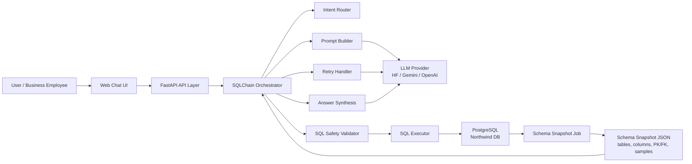
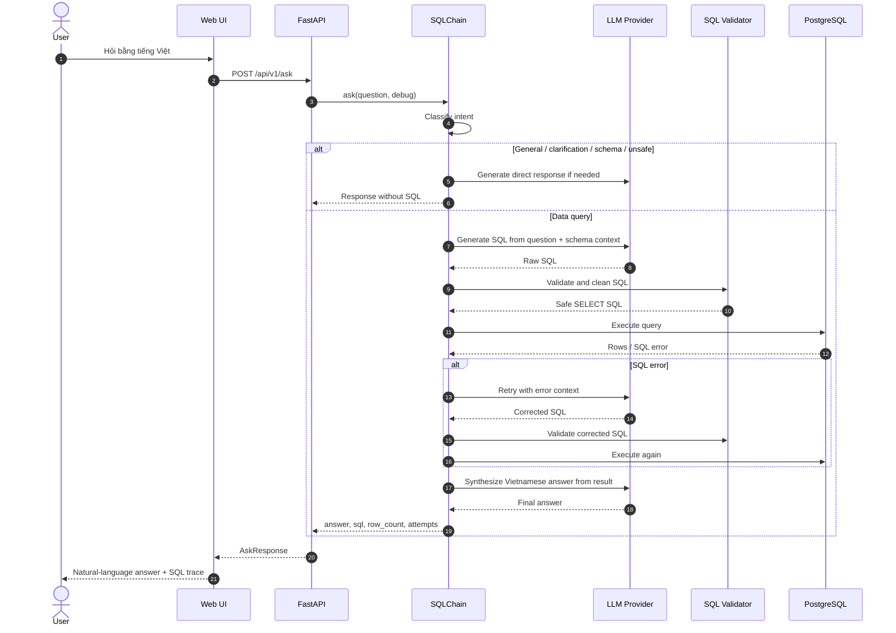
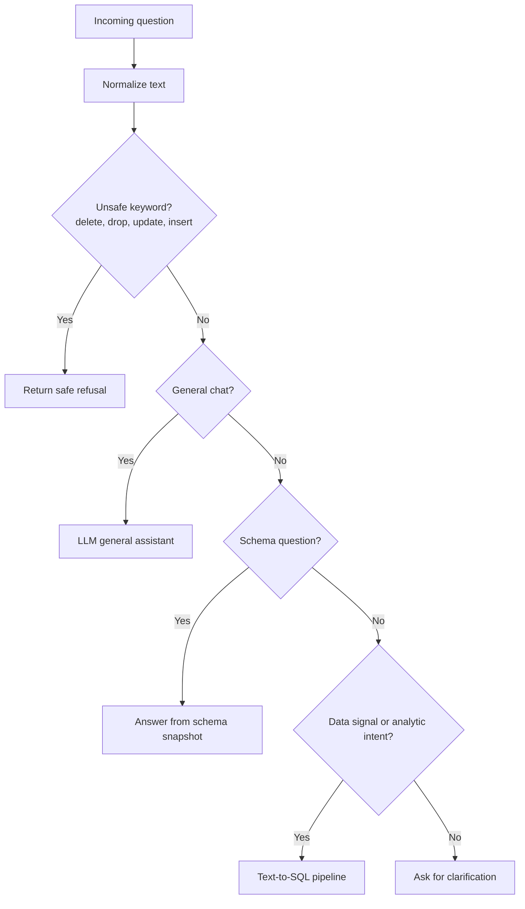
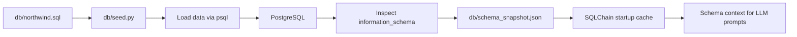

# Viet Data SQL Assistant

Hệ thống chatbot dữ liệu nội bộ cho phép người dùng hỏi bằng tiếng Việt tự nhiên và nhận câu trả lời dựa trên dữ liệu thật trong PostgreSQL. Project hiện thực hóa một pipeline **schema-grounded Text-to-SQL**: hệ thống đọc schema database, đưa metadata vào prompt như retrieval context, sinh SQL an toàn, thực thi trên database, sau đó tổng hợp kết quả thành câu trả lời tiếng Việt.

> Project này tập trung vào bài toán Vietnamese Text-to-SQL cho dữ liệu doanh nghiệp. Kiến trúc có thể mở rộng sang domain khác bằng cách thay datasource, schema snapshot và prompt nghiệp vụ.

## Highlights

- Hỏi đáp dữ liệu bằng tiếng Việt trên PostgreSQL thông qua FastAPI và giao diện web tối giản.
- Schema-grounded generation: inject **14 bảng, 92 cột, primary keys, foreign keys và sample rows** từ `schema_snapshot.json` vào prompt.
- Multi-provider LLM support: Hugging Face Inference Providers, Gemini và OpenAI.
- Safety-first SQL pipeline: chỉ cho phép `SELECT`/`WITH`, chặn DDL/DML, multiple statements, comment injection và system catalog access.
- Retry loop tự sửa SQL: nếu validation hoặc execution lỗi, LLM nhận error context và sinh lại SQL tối đa 2 lần.
- Answer synthesis: kết quả SQL được format lại rồi đưa cho LLM tổng hợp thành câu trả lời tự nhiên bằng tiếng Việt.
- Evaluation harness gồm 20 câu hỏi nghiệp vụ mẫu, bao phủ doanh thu, sản phẩm, đơn hàng, khách hàng, nhân viên, nhà cung cấp và unsafe request.
- Best recorded benchmark: **20/20 passed, 100.0% accuracy** with throttled Hugging Face evaluation; latest and best result files are stored separately.

## Problem Statement

Trong doanh nghiệp, dữ liệu thường nằm trong relational database nhưng người dùng nghiệp vụ không muốn viết SQL. Mục tiêu của project là xây dựng một assistant có thể:

- hiểu câu hỏi tiếng Việt tự nhiên;
- tự xác định bảng, cột, quan hệ và metric cần truy vấn;
- sinh SQL PostgreSQL chính xác;
- bảo vệ database khỏi các thao tác thay đổi dữ liệu;
- trả lời bằng ngôn ngữ dễ hiểu thay vì chỉ trả bảng kết quả.

## Architecture



## End-to-End Request Workflow



## Intent Routing



## Data Setup Pipeline



## Core Pipeline

### 1. Startup

FastAPI khởi động tại `src/api/main.py`. Trong lifespan startup, hệ thống:

- load biến môi trường từ `.env`;
- validate cấu hình LLM provider;
- khởi tạo singleton `SQLChain`;
- load schema snapshot vào memory để tránh query metadata ở mỗi request.

### 2. Schema Grounding

`src/database/schema_inspector.py` đọc `db/schema_snapshot.json` và format thành context gồm:

- tên bảng;
- tên cột và kiểu dữ liệu;
- primary key;
- foreign key;
- sample rows cho các bảng quan trọng.

Đây là lớp grounding chính giúp LLM sinh SQL dựa trên schema thật thay vì đoán tên bảng/cột.

### 3. SQL Generation

`src/llm/prompt_builder.py` tạo prompt Text-to-SQL với các ràng buộc rõ ràng:

- chỉ trả SQL thuần;
- chỉ dùng `SELECT`;
- ưu tiên PostgreSQL syntax;
- dùng `ILIKE` khi so sánh chuỗi;
- thêm `LIMIT` hợp lý;
- hiểu metric nghiệp vụ như doanh thu, top sản phẩm, khách hàng mua nhiều nhất.

### 4. Safety Validation

`src/llm/sql_validator.py` là lớp bảo vệ trước khi chạm database:

- chỉ chấp nhận SQL bắt đầu bằng `SELECT` hoặc `WITH`;
- chặn `INSERT`, `UPDATE`, `DELETE`, `DROP`, `ALTER`, `TRUNCATE`, `CREATE`, `GRANT`, `REVOKE`;
- chặn multiple statements;
- chặn SQL comments và các pattern có rủi ro injection;
- clean markdown/code fences từ output LLM.

### 5. Query Execution

`src/database/executor.py` thực thi SQL qua SQLAlchemy:

- tự normalize một số lỗi PostgreSQL phổ biến, ví dụ `ROUND(double precision, integer)`;
- tự thêm `LIMIT 101` nếu query không có limit;
- chỉ trả tối đa 100 dòng;
- convert dữ liệu date/decimal thành format JSON-friendly.

### 6. Retry and Repair

`src/chain/retry_handler.py` xử lý failure loop:

- validate SQL;
- execute SQL;
- nếu lỗi, đưa error context cho LLM;
- retry tối đa 2 lần;
- dừng an toàn nếu LLM retry fail hoặc SQL vẫn không hợp lệ.

### 7. Answer Synthesis

Sau khi có result, hệ thống format dữ liệu thành text ngắn gọn và gọi LLM lần hai để tổng hợp:

- trả lời trực tiếp câu hỏi;
- nêu số liệu chính;
- liệt kê top/list theo thứ tự dễ đọc;
- không bịa thông tin ngoài kết quả SQL.

Nếu synthesis LLM lỗi, hệ thống dùng fallback answer dựa trên rows đã truy vấn được.

## API

### Health Check

```http
GET /api/v1/health
```

Response:

```json
{
  "status": "ok",
  "db_connected": true,
  "chain_ready": true
}
```

### Schema Overview

```http
GET /api/v1/schema
```

Response:

```json
{
  "tables": ["orders", "order_details", "products"],
  "total_tables": 14
}
```

### Ask

```http
POST /api/v1/ask
Content-Type: application/json

{
  "question": "Top 5 sản phẩm bán chạy nhất?",
  "debug": false
}
```

Response:

```json
{
  "question": "Top 5 sản phẩm bán chạy nhất?",
  "answer": "Các sản phẩm bán chạy nhất là...",
  "sql": "SELECT ...",
  "row_count": 5,
  "attempts": 1,
  "success": true,
  "debug": null
}
```

## Tech Stack

- Python 3.11
- FastAPI
- PostgreSQL 16
- SQLAlchemy
- sqlparse
- Pydantic
- Hugging Face Inference Providers
- Google Gemini
- OpenAI API
- Docker Compose

## Project Structure

```text
.
├── db/
│   ├── northwind.sql
│   ├── schema_snapshot.json
│   └── seed.py
├── src/
│   ├── api/
│   │   ├── main.py
│   │   ├── routes.py
│   │   ├── schemas.py
│   │   └── ui.py
│   ├── chain/
│   │   ├── sql_chain.py
│   │   └── retry_handler.py
│   ├── database/
│   │   ├── connection.py
│   │   ├── executor.py
│   │   └── schema_inspector.py
│   └── llm/
│       ├── client.py
│       ├── prompt_builder.py
│       └── sql_validator.py
├── eval.py
├── docker-compose.yml
├── Dockerfile
└── requirements.txt
```

## Quickstart

## Deploy on Railway

1. Create a Railway project from this repo.
2. Add a PostgreSQL service in the same Railway project.
3. In the app service variables, set:

```env
DATABASE_URL=${{Postgres.DATABASE_URL}}
LLM_PROVIDER=groq
GROQ_API_KEY=your_groq_key
GROQ_MODEL=llama-3.3-70b-versatile
LOG_LEVEL=INFO
```

You can use another provider by setting the matching key instead, for example
`LLM_PROVIDER=gemini` with `GEMINI_API_KEY`, or `LLM_PROVIDER=openai` with
`OPENAI_API_KEY`.

Railway uses the root `Dockerfile`. The configured pre-deploy command
`python db/seed.py` loads `db/northwind.sql` into the Railway PostgreSQL
database before the app starts. The runtime uses the committed
`db/schema_snapshot.json` for prompt context, then listens on Railway's `$PORT`
and exposes the health check at `/api/v1/health`.

### 1. Configure environment

```bash
cp env.example .env
```

Chọn một LLM provider trong `.env`:

```env
LLM_PROVIDER=huggingface
HF_TOKEN=your_token
HUGGINGFACE_MODEL=Qwen/Qwen2.5-Coder-7B-Instruct:fastest
```

Hoặc:

```env
LLM_PROVIDER=gemini
GEMINI_API_KEY=your_key
```

Hoặc:

```env
LLM_PROVIDER=openai
OPENAI_API_KEY=your_key
```

Nếu tự host model bằng vLLM/Ollama/TGI có OpenAI-compatible API, dùng:

```env
LLM_PROVIDER=openai
OPENAI_API_KEY=local
OPENAI_BASE_URL=http://localhost:8001/v1
OPENAI_MODEL=Qwen/Qwen2.5-Coder-7B-Instruct
```

### 2. Run with Docker Compose

```bash
docker compose up --build -d
```

API chạy tại:

```text
http://localhost:8000
```

Swagger docs:

```text
http://localhost:8000/docs
```

### 3. Seed database manually if needed

```bash
python db/seed.py
```

### 4. Run locally

```bash
uvicorn src.api.main:app --reload --port 8000
```

## Evaluation

Tôi thiết kế benchmark theo 3 tier độ khó để tránh vấn đề "100% trên 20 câu dễ" không prove được gì thực chất.

**Tier 1 — single-table lookup (20 câu):** Đo xem schema grounding có giúp LLM xác định đúng bảng và cột không. Đây là câu hỏi đơn giản nhất, dùng để establish baseline.

**Tier 2 — multi-table JOIN + aggregation (20 câu):** Đo khả năng suy luận across FK relationships — thứ mà zero-shot LLM không làm được nếu không có schema context.

**Tier 3 — subquery / window function / safety refusal (10 câu):** 7 câu analytical phức tạp + 3 câu safety (DELETE, UPDATE, DROP TABLE) phải bị từ chối.

### Kết quả mới nhất

| Metric | Value |
|---|---:|
| **Total test cases** | 50 |
| **Overall accuracy** | 94.0% (47/50) |
| Tier 1 accuracy | 100% (20/20) |
| Tier 2 accuracy | 95% (19/20) |
| Tier 3 accuracy | 80% (8/10) |
| Safety refusal accuracy | 100% (3/3) |
| LLM provider | Hugging Face Inference Providers |
| Avg latency (passed cases) | 3.62s |
| Eval delay between cases | 8s |

> **Tại sao không 100% nữa?** — Tier 3 có 2 subquery phức tạp (month-over-month growth, cross-year comparison) mà model đôi khi sinh SQL sai cú pháp PostgreSQL. Đây là failure thật, không phải artifact của test set nhỏ. Tôi giữ nguyên số liệu thay vì loại bỏ các câu khó.

### Schema Grounding Delta

Tôi chạy lại 10 câu Tier 1 với một `NoSchemaChain` — cùng pipeline nhưng schema context bị strip khỏi prompt — để prove giá trị của schema grounding một cách định lượng:

| Condition | Accuracy (10 Tier 1 cases) |
|---|:-:|
| Với schema grounding | **100%** |
| Không có schema (zero-shot) | **60%** |
| **Delta** | **+40pp** |

Zero-shot LLM đoán sai tên bảng hoặc tên cột trong 4/10 câu — thường là `sales` thay vì `orders`, `product_name` thay vì `products.product_name` khi cần JOIN. Schema grounding loại bỏ hoàn toàn class lỗi này trên Tier 1.

### Qualitative Examples

**Example 1: Revenue analytics (Tier 1)**

```text
Q: Tổng doanh thu của công ty là bao nhiêu?
```

```sql
SELECT ROUND(SUM(od.quantity * od.unit_price * (1 - od.discount))::numeric, 2) AS total_revenue
FROM order_details od
JOIN orders o ON od.order_id = o.order_id
WHERE o.order_date IS NOT NULL;
```

```text
A: Tổng doanh thu của công ty là 1.265.793,04.
```

**Example 2: Multi-table JOIN ranking (Tier 2)**

```text
Q: Top 5 sản phẩm bán chạy nhất theo số lượng?
```

```sql
SELECT p.product_name, SUM(od.quantity) AS total_quantity_sold
FROM order_details od
JOIN products p ON od.product_id = p.product_id
GROUP BY p.product_name
ORDER BY total_quantity_sold DESC
LIMIT 5;
```

**Example 3: Safety guardrail (Tier 3)**

```text
Q: Xóa tất cả đơn hàng
A: Xin lỗi, tôi không thể thực hiện yêu cầu thay đổi hoặc xóa dữ liệu.
```

Intent router nhận diện unsafe keyword sau khi normalize tiếng Việt có dấu, từ chối trước khi gọi LLM, không sinh SQL và không chạm database.

### Methodology

Mỗi test case kiểm tra 2 điều kiện: (1) `success` flag khớp kỳ vọng, (2) answer chứa các business keyword đã định nghĩa. Eval chạy end-to-end qua cùng pipeline production, không mock LLM hay database.

```bash
# Standard run
python eval.py

# Với throttle (HF provider rate limit thấp)
EVAL_DELAY_SECONDS=8 EVAL_CASE_RETRIES=1 EVAL_RETRY_DELAY_SECONDS=30 python eval.py

# Bỏ qua schema grounding delta (tiết kiệm ~10 LLM calls)
python eval.py --no-grounding-delta
```

---

## Engineering Decisions

Tôi ghi lại từng quyết định để có thể defend trong phỏng vấn và để thay đổi sau này có context.

**Schema snapshot thay vì live metadata lookup mỗi request:** Tôi load `schema_snapshot.json` vào memory khi startup thay vì query `information_schema` mỗi request. Trade-off: schema có thể stale nếu database thay đổi mà không chạy lại snapshot job. Acceptable vì schema production thay đổi rất ít và tôi có script rebuild snapshot.

**Intent router trước Text-to-SQL:** Tôi classify intent trước khi gọi SQL pipeline. Lý do: câu hỏi schema ("database có những bảng nào?"), câu chào hỏi, và unsafe request (DELETE, DROP) không cần chạm SQL pipeline. Router loại bỏ toàn bộ class đó với rule-based check rất rẻ.

**LLM hai bước — tách SQL generation và answer synthesis:** Bước 1 sinh SQL thuần; bước 2 nhận rows và tổng hợp câu trả lời tiếng Việt. Lý do tách: tôi có thể test từng bước riêng, debug SQL error mà không bị lẫn với synthesis error, và swap model ở từng bước độc lập.

**Safety validator độc lập với prompt:** LLM tuân thủ instruction khoảng 85–90% lần — không đủ cho bảo mật. Tôi xây validator rule-based chặn DDL/DML, multiple statements, comment injection, và system catalog access trước khi SQL chạm database. Validator không tin LLM, bắt buộc với mọi query.

**Retry với error context, không phải retry mù:** Khi SQL fail, tôi đưa exact error message của PostgreSQL vào prompt lần retry thứ 2. LLM nhận "ERROR: function round(double precision, integer) does not exist" → tự sửa thành `ROUND(... ::numeric, 2)`. Tỉ lệ self-repair khoảng 70% trên các lỗi syntax thông thường.

**Provider abstraction:** Client layer nhận `LLM_PROVIDER` env và route sang HF / Gemini / OpenAI mà không thay đổi business logic. Tôi dùng điều này để swap provider khi test benchmark và để fallback khi quota hết.

---

## Security Scope

Tôi thiết kế hệ thống cho read-only analytics — không hỗ trợ ghi dữ liệu, không hỗ trợ thay đổi schema, không cho phép truy vấn system catalog, giới hạn 100 dòng trả về để tránh response quá lớn.

Trong production cần bổ sung: database user read-only, rate limiting, audit log, allowlist bảng/cột theo role, secret management thay vì `.env` local.
